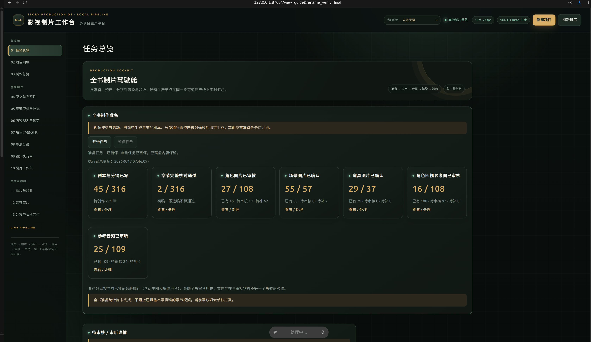

# Novel H3 Studio

一个面向小说长篇影视化的本地制片工作台。它把“原文 → 剧本 → 资产 → 分镜 → 资产绑定镜头执行单 → H3 视听生成 → 逐镜验收 → 分集与全书交付”串成一条可追溯的生产流水线。

本项目的重点不是生成一个几秒钟的演示片，而是把整本小说拆成可管理的章节和镜头，再按原文顺序持续生成、验收、合成。每一章单独保存视频，同时维护一个只包含当前已完成章节的最新全量视频；因此可以从第一章一路扩展到数百章，而不需要把整本书一次性塞进模型上下文。

## 你将得到什么

- **超长小说到超长成片**：支持数百章节、数千镜头的分批生产。章节视频独立落盘，随时可重拍某一个镜头，再重新合成章节和全量长片。
- **长镜头上下文续接**：使用 MiniMax H3 Motion Context 保存和加载视频/音频上下文，让相邻镜头保持动作、声音和剪辑连续性。单镜头按对白和动作内容计算时长，取消人为的 5 秒下限，通常不超过约 15 秒；长对白会拆成语义完整的连续镜头。
- **资产绑定生成**：每个镜头执行单明确列出角色、角色性别、角色四视图、说话人的参考音频、场景、道具、画面动作、运镜和声音要求。生成前会检查资产是否齐全，避免 H3 临时捏出未登记人物或错误场景。
- **对白和音效同场生成**：人物对白由镜头执行单绑定到正确角色及参考音频；旁白默认只作为画面参考，不生成声音。H3 同时生成对白和场内音效，工作台会进行转写核对和异常人声清理。
- **长片可恢复**：队列、镜头指纹、模型配置、提示词、参考资产、审核状态和合成结果都保存到项目目录。服务重启后可以从未完成的镜头继续，不必从头计算。
- **多项目切换**：一本小说对应一个项目。工作台支持创建、切换、重命名和删除项目，进度、资产、剧本、镜头和视频互相隔离。
- **本地优先**：小说、图片、音频和视频默认只留在本机；ComfyUI、工作台和音频审片服务只监听本机地址，除非你主动配置公网网关。

下面是工作台的真实总览页截图。页面把当前项目、全书制作准备、剧本/分镜数量、角色四视图、场景、道具、参考音频和待审核入口放在同一条生产线上；进入其他项目后，所有数字和资产会随项目切换。



截图中的计数是当时项目的运行快照，重新打开工作台后会以本机当前状态为准。

看片与验收页用于逐镜观看、听音和决定是否重拍。每个卡片保留章节/镜头编号、生成状态、当前引擎、参考音频绑定和视频预览；点击重拍后，审核意见会进入视频生成页的高优先级队列。


## 已验证的本地运行环境

下面是本仓库在开发机上真实运行过的环境，其他机器可以使用相同的大版本；GPU 显存越小，越需要降低分辨率、帧数或启用更积极的卸载。

| 项目 | 开发机实测值 |
| --- | --- |
| 操作系统 | Ubuntu Linux x86_64，内核 7.0.0-31-generic |
| Python | 3.13.13（项目要求 Python 3.11 或更高） |
| GPU | NVIDIA GeForce RTX 5090，32,607 MiB 显存 |
| NVIDIA 驱动 | 595.91.07 |
| PyTorch | 2.13.0+cu130 |
| CUDA | 13.0，`torch.cuda.is_available()` 为 `True` |
| ComfyUI | 独立目录 `/home/jx/codes/comfyui-minimax-h3`，专用端口 8191 |
| 工作台 | Python 标准库服务，默认端口 8765 |
| 视频参数 | 16:9，24 fps，H3 内部 1376×768，当前交付 1366×768 |
| 默认视频引擎 | VDN-H3 Turbo，8 步，ComfyUI H3 Motion Context |

本仓库不上传大模型、小说正文、生成视频、音频、运行日志或项目状态。它们由下面的步骤在本机准备，并被 `.gitignore` 排除。

## 一、安装系统依赖

### 1. 基础工具

```bash
sudo apt-get update
sudo apt-get install -y git ffmpeg python3 python3-venv python3-pip
```

确认版本：

```bash
python3 --version          # 3.11 或更高
ffmpeg -version
nvidia-smi                 # NVIDIA 驱动和显卡应能被看到
```

### 2. 安装工作台

```bash
git clone https://github.com/jx1100370217/novel-h3-studio.git
cd novel-h3-studio
python3 -m venv .venv
. .venv/bin/activate
python -m pip install -U pip
python -m pip install -e .
```

工作台本身只需要 `websocket-client` 和 Python 标准库。视频推理依赖 ComfyUI 的独立环境，音频审片依赖单独的 `.venv-audio`，两者不会互相升级或覆盖。

## 二、安装 ComfyUI 和固定扩展

推荐把 ComfyUI 放在工作台外部，避免升级工作台时碰到模型目录：

```bash
export COMFY_ROOT=/home/jx/codes/comfyui-minimax-h3
git clone https://github.com/comfyanonymous/ComfyUI.git "$COMFY_ROOT"
cd "$COMFY_ROOT"
python3 -m venv .venv
. .venv/bin/activate
python -m pip install -U pip
# 按当前 GPU / CUDA 版本安装官方 PyTorch，再安装 ComfyUI 依赖
python -m pip install -r requirements.txt
cd /home/jx/codes/novel-h3-studio
```

> 如果机器上已经有可运行的 ComfyUI，只需把 `COMFY_ROOT` 改成现有目录，不要重复安装。`start_comfy.py` 会使用 `$COMFY_ROOT/.venv/bin/python`，并只挂载本项目固定的扩展。

下载并固定本项目使用的扩展：

```bash
python3 fetch_vendor.py
```

固定版本记录在 [`upstream.json`](upstream.json)：

- [ComfyUI-H3-Motion-Context](https://github.com/NikoDemon80/ComfyUI-H3-Motion-Context)：`5335715abe54c1a9bfbe3494da29aae3e8635ce3`。
- [ComfyUI-VDN-H3](https://github.com/Saganaki22/ComfyUI-VDN-H3)：v1.5.2，`3eb63496c24ca70faaf8a14b6c75fcb480e34bf1`。
- [ArcReel](https://github.com/ArcReel/ArcReel)：作为剧本/资产数据结构参考，不作为运行时依赖。

## 三、下载模型（大文件不进 Git）

所有模型都应放在本机模型目录或 Hugging Face 缓存中。下面的命令使用官方仓库和固定文件名；下载完成后运行 `doctor`，它会指出缺失的文件和实际搜索路径。

先安装 Hugging Face CLI，并在需要时登录：

```bash
python3 -m pip install -U "huggingface_hub[cli]"
# 公开模型无需登录；若账户受到限流或模型要求同意协议，再执行：
hf auth login
```

### 1. MiniMax H3 ComfyUI 基础权重（生产必需）

官方模型页：[Comfy-Org/MiniMax-H3](https://huggingface.co/Comfy-Org/MiniMax-H3)。本工作台默认使用 INT8 convrot 变体，适合显存有限的本地部署。下载到 ComfyUI 的对应目录：

```bash
export COMFY_ROOT=/home/jx/codes/comfyui-minimax-h3
mkdir -p "$COMFY_ROOT/models/diffusion_models" \
         "$COMFY_ROOT/models/text_encoders" \
         "$COMFY_ROOT/models/vae"

hf download Comfy-Org/MiniMax-H3 \
  diffusion_models/minimax_h3_fl2va_pruned_int8_convrot.safetensors \
  diffusion_models/minimax_h3_ref2va_pruned_int8_convrot.safetensors \
  text_encoders/qwen3vl_32b_minimax_h3_nvfp4_awq.safetensors \
  vae/minimax_h3_audio_vae_fp32.safetensors \
  vae/minimax_h3_video_vae_fp16.safetensors \
  --local-dir "$COMFY_ROOT/models"
```

当前配置使用的文件清单：

| ComfyUI 目录 | 文件 | 用途 |
| --- | --- | --- |
| `models/diffusion_models` | `minimax_h3_fl2va_pruned_int8_convrot.safetensors` | 首帧/文本到视听视频的基础扩散模型 |
| `models/diffusion_models` | `minimax_h3_ref2va_pruned_int8_convrot.safetensors` | 参考图到视听视频 |
| `models/text_encoders` | `qwen3vl_32b_minimax_h3_nvfp4_awq.safetensors` | H3 文本/视觉编码 |
| `models/vae` | `minimax_h3_audio_vae_fp32.safetensors` | 音频 VAE |
| `models/vae` | `minimax_h3_video_vae_fp16.safetensors` | 视频 VAE |

如果你改用官方页提供的 `minimax_h3_video_vae_int8_convrot.safetensors`，需同时在项目 `config.json` 的 `models.video_vae` 改成该文件名，再运行 `python3 studio.py --project /absolute/project/ doctor`。不要只改文件名而不改配置。

原始模型页：[MiniMaxAI/MiniMax-H3](https://huggingface.co/MiniMaxAI/MiniMax-H3)。原始仓库体积非常大，普通本地生产不需要下载完整快照；优先使用上面的 Comfy-Org 打包版本。

### 2. VDN-H3 Turbo 权重（生产必需）

VDN-H3 官方说明：[ComfyUI-VDN-H3](https://github.com/Saganaki22/ComfyUI-VDN-H3)，权重仓库：[vdn-minimax-h3-int8-convrot-comfyui](https://huggingface.co/drbaph/vdn-minimax-h3-int8-convrot-comfyui)。

```bash
mkdir -p "$COMFY_ROOT/models/vdn/vdn-minimax-h3-int8-convrot-comfyui"
hf download drbaph/vdn-minimax-h3-int8-convrot-comfyui \
  --local-dir "$COMFY_ROOT/models/vdn/vdn-minimax-h3-int8-convrot-comfyui"
```

项目配置中的 `vdn_checkpoint` 必须保持为：

```json
"vdn_checkpoint": "vdn-minimax-h3-int8-convrot-comfyui"
```

不要把 VDN 文件复制到 `models/diffusion_models`；VDN 节点会从 `models/vdn` 查找。

### 3. 图片资产模型

角色、场景、道具和分镜首尾帧统一通过当前 Codex 对话里的图片工具生成。该工具是订阅能力，不是本地可下载的权重；工具不暴露底层模型选择参数，因此工作台会保存真实图片回执和 `model_verified` 状态，但不会伪造“已验证为 Images 2.5”。没有图片工具时，工作台会把图片工作单放入待处理状态，不会偷偷改用其他生图 API。

### 4. 本地音频审片模型（可选，但验收长片建议安装）

音频审片默认使用：

- [Whisper large-v3-turbo](https://huggingface.co/openai/whisper-large-v3-turbo)：对白转写。
- [AST AudioSet](https://huggingface.co/MIT/ast-finetuned-audioset-10-10-0.4593)：雷声、水声、脚步等环境声分类。
- [Qwen2.5-Omni-7B](https://huggingface.co/Qwen/Qwen2.5-Omni-7B)：复杂音频理解和转写冲突辅助判断。

安装独立环境：

```bash
cd /home/jx/codes/novel-h3-studio
python3 setup_audio.py
```

如需预热指定版本，可执行：

```bash
hf download openai/whisper-large-v3-turbo \
  --revision 41f01f3fe87f28c78e2fbf8b568835947dd65ed9
hf download MIT/ast-finetuned-audioset-10-10-0.4593 \
  --revision f826b80d28226b62986cc218e5cec390b1096902
hf download Qwen/Qwen2.5-Omni-7B \
  --revision ae9e1690543ffd5c0221dc27f79834d0294cba00
```

本地命令：

```bash
/home/jx/codes/novel-h3-studio/listen_audio \
  /absolute/path/chapter_s0003.mp4 \
  --out /absolute/path/audio-review
```

首次分析约需要 18 GiB 可用显存。视频推理正在占用本项目显卡时，工作台会阻止并行音频分析，避免把显存打满。完整说明见 [`docs/本地音频理解.md`](docs/本地音频理解.md)。

### 5. FastVideo FastH3-8-Step-V2（可选 ComfyUI 速度基准）

工作台保留的是 **FastH3-8-Step-V2 的 ComfyUI 兼容路径**，不包含官方 VSA-H3 runner。兼容权重由官方模型页转换为 ComfyUI 单文件格式，来源仍是 [FastVideo/FastVideo-FastH3-8-Step-V2](https://huggingface.co/FastVideo/FastVideo-FastH3-8-Step-V2)，可从 [FastVideo/FastVideo-FastH3-Comfy](https://huggingface.co/FastVideo/FastVideo-FastH3-Comfy) 获取。

下载 ComfyUI 基准需要的 INT8 ConvRot 视频模型：

```bash
hf download FastVideo/FastVideo-FastH3-Comfy \
  diffusion_models/fastvideo_fasth3_8step_v2_pruned_int8_convrot.safetensors \
  --local-dir "$COMFY_ROOT"
python3 scripts/run_fasth3_benchmark.py --help
```

它使用现有 ComfyUI 的 H3 文本编码器、音频 VAE、视频 VAE 和保存节点，只把视频扩散模型替换为 FastH3 兼容单文件；不改变生产配置、镜头指纹或已生成视频。基准结果写入项目的 `benchmarks/`，该目录属于生成数据，不上传 Git。详细说明见 [`docs/FastVideo基准接入.md`](docs/FastVideo基准接入.md)。

## 四、启动服务并做环境自检

先启动专用 ComfyUI：

```bash
cd /home/jx/codes/novel-h3-studio
python3 fetch_vendor.py
python3 start_comfy.py
```

它会使用 `COMFY_ROOT/.venv/bin/python`，监听 `127.0.0.1:8191`，并启用显存保护参数。另开终端启动工作台：

```bash
cd /home/jx/codes/novel-h3-studio
python3 studio.py --project /absolute/project/path serve --no-browser
```

浏览器打开：<http://127.0.0.1:8765>。

启动后先自检：

```bash
python3 studio.py --project /absolute/project/path doctor
```

`doctor` 至少要通过：ComfyUI 可达、基础 H3 文件存在、VDN 目录存在、Motion Context/VDN 节点已加载、FFmpeg/FFprobe 可用、项目配置和分辨率一致。自检失败时不要点击视频生成，先按输出中的文件路径补齐。

## 五、从一本新小说开始：完整操作顺序

下面既可以通过工作台页面点击，也可以用 CLI。页面适合日常制作，CLI 适合自动化和服务器。

### 1. 创建项目并上传原文

在工作台顶部点击 **新建项目**，填写项目名称、项目目录和 TXT 原文，提交后切换到新项目。也可以：

```bash
python3 studio.py --project /absolute/projects/my-novel init \
  /absolute/path/小说.txt
```

项目目录只存这本小说的状态。原文不会被改写；缺章、重复章号、连载状态和作者资料会被记录，不能用脚本静默补齐。

### 2. 原文完整性和章节分析

点击 **原文与完整性**，逐章确认物理顺序、章节标题和异常。然后在 **内容规划与锁定** 中执行：

```bash
python3 studio.py --project /absolute/projects/my-novel prepare
python3 studio.py --project /absolute/projects/my-novel status
```

分析工作单必须覆盖原文提供的每个章节段落。候选稿、初稿不算“已核对通过”。

### 3. 编剧与对话绑定

为每段剧情建立带明确说话人的剧本和分镜。对白写入角色字段，旁白只写入视觉参考字段；不要把视觉元数据、系统提示或美术说明放进可发声文本。对白按完整语义切分，时长由内容计算，上限约 15 秒，没有 5 秒下限。

```bash
python3 studio.py --project /absolute/projects/my-novel import-content /absolute/path/content.json
python3 studio.py --project /absolute/projects/my-novel approve-content <episode> \
  --reviewer user --note "已核对章节语义、对白和说话人"
```

### 4. 角色、场景、道具和参考音频

在 **角色·场景·道具** 页面完成资产清单：

1. 角色：姓名、别名、性别、年龄段、身份、服饰、四视参考图（正面/背面/侧面/脸部特写）。
2. 说话角色：一条经审听的参考音频；同一角色在所有镜头复用同一音频资产。
3. 场景：地点、时间、天气、光线、空间锚点和允许出现的道具。
4. 道具：名称、形状、材质、尺寸、持有者和出场镜头。

图片工作单通过 Codex 图片工具执行，随后登记回执和文件校验值：

```bash
python3 studio.py --project /absolute/projects/my-novel asset-jobs
python3 studio.py --project /absolute/projects/my-novel import-assets /absolute/path/assets.json
python3 studio.py --project /absolute/projects/my-novel register-image \
  <asset-id> /absolute/path/image.png /absolute/path/image_receipt.json
python3 studio.py --project /absolute/projects/my-novel approve-image <asset-id> \
  --reviewer user --note "已核对来源、角色一致性和画面质量"
```

技术预检不通过时，优先点击工作台中的 **重新生成**，而不是强行批量通过。人工需要审核的角色保留确认按钮；场景和道具可以按项目规则自动确认，但仍需保留来源和校验记录。

### 5. 导演分镜和资产绑定镜头执行单

先生成或导入导演分镜，再编译为最终送给 H3 的资产绑定执行单：

```bash
python3 studio.py --project /absolute/projects/my-novel visual-packet <episode>
python3 studio.py --project /absolute/projects/my-novel compile-visual <episode> \
  /absolute/path/visual_candidate.json
python3 studio.py --project /absolute/projects/my-novel packet <episode>
```

最终执行单必须同时包含：镜头 ID、原文引用、对白和说话人、角色/性别/视角图片、参考音频、场景锚点、道具、多人站位、景别、焦段、运镜动机、动作时间线、剪辑入口/出口、对白音量和场内音效。有人物对白时只允许登记角色出场；无人物对白的纯环境镜头才允许没有角色。视觉元数据必须标为不可发声。

在送入 H3 前检查：

```bash
python3 studio.py --project /absolute/projects/my-novel validate <episode>
python3 studio.py --project /absolute/projects/my-novel approve-plan <episode> \
  --reviewer user --note "已核对资产绑定、时长、运镜和对白"
```

### 6. 生成章节视频

视频生成只检查当前待生成章节的剧本、执行单、角色、参考音频、场景和道具是否齐全；其他章节可以并行准备。页面中点击 **视频生成进度 → 开始任务**，或执行：

```bash
python3 studio.py --project /absolute/projects/my-novel submit <episode>
python3 studio.py --project /absolute/projects/my-novel sync
```

正常生成顺序是：高优先级重拍 → 当前章节普通镜头 → 下一章资料就绪后继续。审核中标记“需重拍”会把审核意见注入重拍提示词，并在当前镜头完成后优先生成。严格转写失败不会无限重试；达到上限会保留视频并加特殊标记，随后继续队列。

章节视频的位置：

```text
projects/<project-id>/chapter_videos/chapter_s0003.mp4
```

每个镜头、提示词、模型配置、资产指纹、音频清洗记录和审核结果都在项目状态中留档。清空视频前请确认是否还需要保留 AV latent 和审片报告。

### 7. 看片、音频审片和交付

在 **看片与验收** 中逐镜观看和听音，确认画面、人物、场景、道具、运镜、对白、口型和音效。需要重拍就填写具体意见并点击 **标记需重拍**；工作台会把它放入视频生成页的高优先级队列。

```bash
cp examples/review_template.json /tmp/review.json
# 编辑 /tmp/review.json：approved、reviewer、note 和 checks 必须按实际看片填写
python3 studio.py --project /absolute/projects/my-novel review-take \
  <take-id> /tmp/review.json
python3 studio.py --project /absolute/projects/my-novel assemble-chapter <episode>
python3 studio.py --project /absolute/projects/my-novel assemble-latest
python3 studio.py --project /absolute/projects/my-novel assemble-book
```

输出：

```text
projects/<project-id>/chapter_videos/chapter_s####.mp4
projects/<project-id>/final/latest_full_video.mp4
projects/<project-id>/final/book_full_video.mp4
```

合成只包含已验收镜头。最新全量视频每次覆盖为当前已完成章节的顺序合并；章节视频保留独立文件，方便重拍和重新合成。

## 六、VDN-H3 本地生成速度记录

这是开发机 RTX 5090 上的真实生产配置对比，不是同一步数、同一算法的实验室基准。两组都使用同一台机器、同一套基础量化权重、相同镜头条件和 24 fps；VDN 使用 8 步 `er_sde / beta`，旧方案使用普通 H3 32 步 `res_multistep / simple`。计时从 ComfyUI `execution_start` 到 `execution_success`，包含模型准备、采样、解码和保存，不包含排队、图片生成、审片、重拍、合成和超分。

| 镜头 | 成片时长 | 普通 MiniMax H3 · 32 步 | VDN-H3 Turbo · 8 步 | 实测加速 |
| --- | ---: | ---: | ---: | ---: |
| 洪水首镜 | 5.167 秒 | 193.423 秒 | 69.546 秒 | 2.78× |
| 洪水续镜 | 5.667 秒 | 326.891 秒 | 95.805 秒 | 3.41× |
| 振明狩猎 | 5.167 秒 | 197.151 秒 | 68.160 秒 | 2.89× |
| **合计** | **16.000 秒** | **717.465 秒** | **233.511 秒** | **3.07×** |

这组结果说明 VDN-H3 Turbo 在当前本机配置下明显更快，但不能承诺所有镜头、冷启动和显存状态都保持同一倍数。第三条 VDN 任务曾在 4/8 步被服务 SIGTERM 中断，重启后才成功；中断本身不计入上表。完整原始数据、参数、权重指纹和限制见 [`docs/VDN-H3切换与实测.md`](docs/VDN-H3切换与实测.md) 和 [`docs/qa/vdn-speed-comparison.json`](docs/qa/vdn-speed-comparison.json)。

当前 VDN 生产配置：

```text
ComfyUI: 127.0.0.1:8191
工作台:   127.0.0.1:8765
采样:     8 步，er_sde / beta，VDN Turbo
内部画布: 1376×768，交付 1366×768，24 fps
显存保护: 预留 4 GiB，关闭异步卸载和 pinned memory，单进程模型缓存
```

模型只在专用 ComfyUI 进程启动时加载一次；逐镜任务复用已加载模型，不应每个镜头重新装载。若工作台显示“加载模型”很久，先看 ComfyUI 日志和 `doctor`，不要并行启动第二个视频 worker。

## 七、常用排错

### 工作台打不开

```bash
ss -ltnp | rg '8765|8191'
python3 studio.py --project /absolute/project/path doctor
```

确保工作台和 ComfyUI 都由当前代码启动。修改会影响服务端的 Python 文件后，先停止旧进程，再重新运行 `studio.py ... serve`；只刷新浏览器不会加载旧进程的新代码。

### 模型找不到

1. 检查 `config.json` 中的 `comfy_root` 和文件名。
2. 确认模型位于 `models/diffusion_models`、`models/text_encoders`、`models/vae`、`models/vdn` 的正确层级。
3. 重新执行 `python3 studio.py --project ... doctor`。
4. 查看 ComfyUI 启动日志，确认 Motion Context 和 VDN 节点没有被另一份 custom node 覆盖。

### 任务卡在加载或显存不足

- 一台机器只保留一个本项目 ComfyUI 8191 进程和一个视频 worker。
- 停止音频审片、FastVideo 基准和其他占用显卡的任务。
- 使用 1366×768 或更低分辨率，减少同时运行的任务；不要绕过 `GENERATION_PAUSED` 保护。
- 确认 `nvidia-smi` 中显存、温度和功耗正常；服务异常退出后先查看日志再重试。

### 转写失败或出现异常人声

严格转写核对不能通过“放宽条件”解决。先确认资产绑定执行单中的说话人、参考音频和对白文本，再让工作台做异常人声清理；清理只针对不属于登记角色对白的人声，尽量保留雷声、水声、脚步等场内音效。连续失败达到限制后视频会保留并标记，不会无限重生成。

### 合成的视频缺章节

章节只有在镜头通过验收后才会进入合成。检查：

```bash
python3 studio.py --project /absolute/project/path coverage
python3 studio.py --project /absolute/project/path status
```

不要把“镜头已生成”误认为“章节已交付”；必须完成审片和章节合成。

## 八、代码和数据边界

提交到 GitHub 的内容包括工作台代码、固定版本记录、示例、测试、文档和模型获取说明。以下内容明确不上传：

- `projects/`：小说原文、角色图片、参考音频、剧本、镜头和视频。
- `runtime/`：队列状态、日志、ComfyUI 数据库、临时文件和本机凭据。
- `vendor/`：上游扩展的本地 checkout；用 `fetch_vendor.py` 按 `upstream.json` 重建。
- `.venv/`、`.venv-audio/`、模型目录、Hugging Face 缓存、编译缓存和生成视频。

许可证和上游声明见 [`LICENSE`](LICENSE) 与 [`NOTICE.md`](NOTICE.md)。使用 ArcReel、Motion Context 或 VDN-H3 时，还要遵守对应仓库的许可证和模型条款。

## 九、验证清单

提交或迁移到另一台机器后，按这个顺序检查：

```bash
cd /home/jx/codes/novel-h3-studio
python3 -m unittest discover -s tests -p 'test_*.py' -q
python3 studio.py --project /absolute/project/path doctor
python3 studio.py --project /absolute/project/path status
```

然后在浏览器打开工作台，确认：

1. 项目下拉框能切换项目，当前项目名称和目录正确。
2. 制作准备页面显示剧本、角色、场景、道具和参考音频的真实数量。
3. 视频生成页面显示当前引擎 `VDN-H3 Turbo · 8 步`、实时采样和重拍队列。
4. 镜头执行单能展开查看所有资产绑定，旁白被标为“视觉参考，不发声”。
5. 看片与验收中的重拍意见会出现在视频生成页面，并在当前镜头完成后优先执行。
6. 章节视频和 `final/latest_full_video.mp4` 的分辨率、帧率、音画长度和章节顺序通过检查。

## 十、代码结构

| 路径 | 作用 |
| --- | --- |
| `novel_h3/project.py` | 多项目目录、配置和状态 |
| `novel_h3/preparation.py` | 原文、章节、剧本、资产和准备门禁 |
| `novel_h3/director.py` | 分镜节奏、运镜、时长和提示词 |
| `novel_h3/shot_package.py` | 资产绑定镜头执行单和 H3 输入包 |
| `novel_h3/comfy.py` | ComfyUI 提交、恢复、取消、模型和媒体回写 |
| `novel_h3/audio_cleanup.py` | 异常人声检测与音频清理 |
| `novel_h3/media.py` | 技术检查、字幕、章节与全量合成 |
| `novel_h3/server.py` / `novel_h3/web.html` | 工作台 API 与界面 |
| `fetch_vendor.py` / `start_comfy.py` | 固定扩展获取与专用 ComfyUI 启动 |
| `docs/` | 制作规范、音频审片、VDN 实测和 FastVideo 隔离基准 |
| `tests/` | 工作流、UI、资产、音频、队列和安全测试 |

如果你只想先验证流程，可以用 `examples/` 中的最小示例创建项目；如果要制作真实长篇小说，请先完成原文完整性和资产登记，再启动视频队列。
